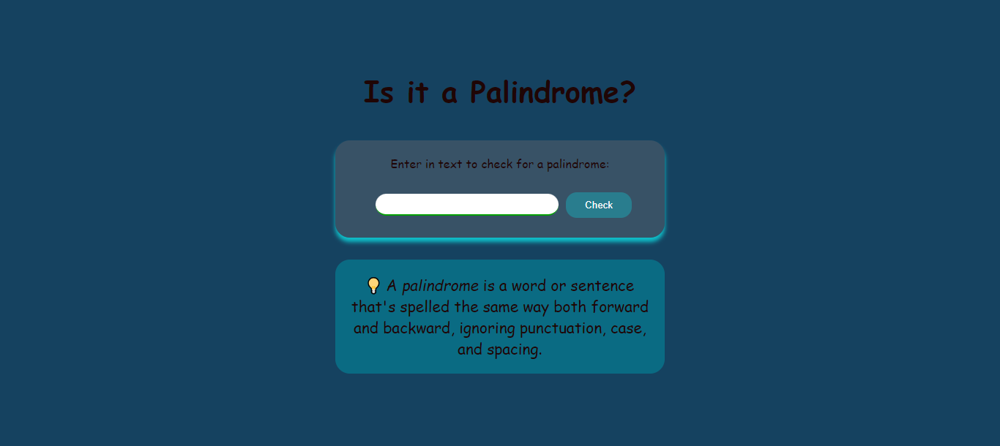

# Palindrome-Checker 🚀
## Simple-Palindrome-checker
## Project Description 📝
This project is a Palindrome Checker web application. It includes an HTML form where users can input text to check if it is a palindrome. A palindrome is a word or sentence that reads the same forward and backward, ignoring punctuation, case, and spacing. The application enhances user experience with responsive design elements and interactive functionality. 

## Demo 📸

![Demo] (./img/palindrome.png)
## Technologies Used 🛠️
- HTML
- CSS
- JAVA-SCRIPT

## Installation 💻
Folow these steps to set up the project on your local machine 
Ensure you have the following software installed on your machine

```bash
#git clone
```
```bash
#git@github.com:Saqibi4213/palindrome-checker.git
```
## Usage 🎯

you can access to my project through git clone 
-git clone the HTTP or My SSH code link from the repository you wat to clone 

```bash
#git clone
```

## Features ⭐
1. *User Input Field*:
   - HTML input element for users to enter text to be checked.

2. *Check Button*:
   - HTML button that triggers the palindrome checking function when clicked.

3. *Result Display*:
   - A dynamic result display area that shows whether the input text is a palindrome.

4. *Responsive Design*:
   - CSS ensures the application is usable and visually appealing on different screen sizes.
   - Media queries adjust font sizes and layout for smaller screens.

5. *Styled Interface*:
   - CSS styles provide a modern and clean look with custom fonts, colors, and spacing.
   - Box shadows, rounded corners, and background colors enhance the visual appeal.

6. *Interactive Feedback*:
   - JavaScript handles the logic to check if the input is a palindrome.
   - The result area updates in real-time based on user input.

7. *Accessibility*:
   - Proper labeling of input elements for accessibility.
   - Use of semantic HTML elements like <main>, <label>, and <dfn>.

8. *Client-side Validation*:
   - JavaScript processes and validates input without needing to reload the page.

9. *Hidden and Visible Elements*:
   - CSS classes to show or hide the result area dynamically based on user interaction.

10. *Definition Section*:
    - An informative section explaining what a palindrome is, including an accessible emoji.


## Author 👩‍💻

Mehria Saqibi 
 <br>
 Email: mosawermh@gmail.com
 <br>
 LinkedIn: [Mheria saqibi] https://www.linkedin.com/in/mheria-saqibi-a386a41a1?utm_source=share&utm_campaign=share_via&utm_content=profile&utm_medium=android_app
 <br>
 Website : https://saqibi4213.github.io/palindrome-checker/

## Contributing 🤝

We welcome contributions from the community! Please follow the guidelines below to contribute to our project.
<br />
1: Fork the Repository: Click the "Fork" button at the top right of the repository page to create a copy of the repository on your GitHub account.
<br />
2: Clone Your Fork: Clone your forked repository to your local machine using the following command:git clone https://github.com/yourusername/yourprojectname.git
<br />
3: Create a Branch: Create a new branch for your work to ensure your changes are isolated from the main branch:git checkout -b feature-or-bugfix-description
<br />
4: Make Your Changes: Implement your changes, whether fixing a bug or adding a new feature. Be sure to follow the project's coding standards and guidelines.
<br />
5: Commit Your Changes: Commit your changes with a descriptive commit message:git add .
git commit -m "Description of the changes"
<br />
6: Push to Your Fork: Push your changes to your forked repository:git push origin feature-or-bugfix-description
<br />
7: Submit a Pull Request: Go to the original repository and submit a pull request from your forked repository. Provide a clear and concise description of your changes and why they should be merged.

## License 📜

